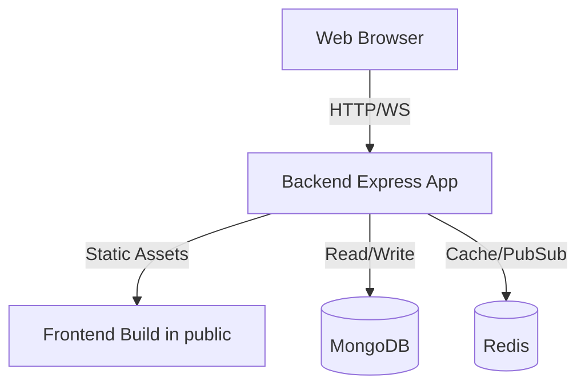

# Master Dashboard


A complete MERN-stack administrative dashboard solution designed for scalability, security, and ease of deployment.

## Features

- **Comprehensive Admin Panel**: Full management of users, roles, and settings.
- **Real-time Updates**: Socket.io integration for live data and notifications.
- **Advanced Security**: JWT authentication, rate limiting, and encrypted credentials.
- **Containerized**: Full Docker Compose setup for both development and production.
- **CI/CD Ready**: Pre-configured GitHub Actions workflows.
- **Monitoring & Alerts**: Built-in integrations for Slack, Telegram, and Email alerts.

## Tech Stack

| Domain | Technology |
|---|---|
| Frontend | React, Vite, TypeScript |
| Backend | Node.js, Express, TypeScript, Socket.io |
| Database | MongoDB |
| Cache & Pub/Sub | Redis |
| Proxy & Static Files | Express |
| Deployment | Docker, GitHub Actions |

## Prerequisites

- Docker and Docker Compose
- Node.js 20+ (for local development without Docker)

## Quick Start (Development)

Follow these steps to get the application running locally in development mode:

1. **Clone the repository:**
   ```bash
   git clone https://github.com/your-org/masterdashboard.git
   cd masterdashboard
   ```

2. **Configure environment variables:**
   ```bash
   cp .env.example .env
   # Open .env and fill in the required values (e.g., encryption keys)
   ```

3. **Start the database and cache:**
   ```bash
   docker compose up -d mongo redis
   ```

4. **Start the backend:**
   ```bash
   cd apps/backend
   npm install
   npm run dev
   ```

5. **Start the frontend:**
   ```bash
   cd ../frontend
   npm install
   npm run dev
   ```

6. **Access the application:**
   - Open your browser to [http://localhost:5173](http://localhost:5173)

7. **Seed initial data (optional):**
   ```bash
   cd apps/backend
   npm run seed
   ```

## Docker Compose Full Stack

To run the entire stack (including backend and frontend) via Docker Compose for development:

```bash
docker compose up --build
```

## Production Deployment Without Docker

The backend serves the compiled frontend from `apps/backend/public`, so the API and dashboard use the same domain.

1. **Install prerequisites on the server:** Node.js 20+, Nginx, MongoDB, and Redis. MongoDB and Redis may also be hosted services.

2. **Install dependencies and build the frontend:**
   ```bash
   cd apps/frontend
   npm ci
   npm run build
   rm -rf ../backend/public
   cp -R dist ../backend/public
   ```

3. **Build the backend:**
   ```bash
   cd ../backend
   npm ci
   npm run build
   npm prune --omit=dev
   ```

4. **Configure `.env`** with production values, including `NODE_ENV=production`, `PORT=3001`, the database URLs, and `CLIENT_URL=http://masterdashabord.itfuturz.in`.

5. **Run the backend with a process manager:**
   ```bash
   sudo npm install -g pm2
   pm2 start dist/index.js --name masterdashboard-backend
   pm2 save
   pm2 startup
   ```

6. **Configure Nginx** to use `nginx/default.conf` with `server_name masterdashabord.itfuturz.in`, then run `sudo nginx -t && sudo systemctl reload nginx`.

7. **Open the dashboard:** Visit `http://masterdashabord.itfuturz.in/`. API and Socket.IO requests use the same domain.

### Seed the production database

Run this before `npm prune --omit=dev` because the seed command uses `ts-node`:

```bash
cd apps/backend
npm run seed
```

The seed creates the owner account `admin@masterdashboard.com`, seven projects, and the initial service. It does not drop the database. The initial password is `Admin@1234`; change it after the first login.

### Deploy a later code update

```bash
git pull
cd apps/frontend
npm ci
npm run build
rm -rf ../backend/public
cp -R dist ../backend/public

cd ../backend
npm ci
npm run build
npm run seed
npm prune --omit=dev
pm2 restart masterdashboard-backend --update-env
pm2 save
```

## Environment Variables

| Variable | Description | Example | Required |
|---|---|---|---|
| `NODE_ENV` | Environment mode | `development` | Yes |
| `PORT` | Backend port | `3001` | Yes |
| `MONGODB_URI` | MongoDB connection string | `mongodb://mongo:27017/masterdashboard` | Yes |
| `REDIS_URL` | Redis connection string | `redis://redis:6379` | Yes |
| `JWT_ACCESS_SECRET` | Secret for access tokens | `...` | Yes |
| `MASTER_ENCRYPTION_KEY` | Key for encrypting sensitive data | `...` | Yes |

*See `.env.example` for a comprehensive list of all environment variables.*

## API Documentation

When running with `ENABLE_SWAGGER=true`, interactive API documentation is available at:
`http://localhost:3001/api/docs`

## Default Credentials

A default admin account is created upon seeding the database. **Ensure you change this immediately in production.**

- **Email:** admin@masterdashboard.com
- **Password:** Admin@1234

## Testing

Run unit and integration tests for individual apps:

**Backend:**
```bash
cd apps/backend
npm test
```

**Frontend:**
```bash
cd apps/frontend
npm test
```

## Backup Strategy

Database backups are managed via shell scripts found in the `scripts/` directory.

- **Backup:** Run `./scripts/backup-mongo.sh` (Recommend scheduling this via a nightly cron job)
- **Restore:** Run `./scripts/restore-mongo.sh <path-to-tar.gz>`

## Architecture



## Contributing

Please read `CONTRIBUTING.md` for details on our code of conduct, and the process for submitting pull requests to us.

## License

This project is licensed under the MIT License - see the LICENSE file for details.
